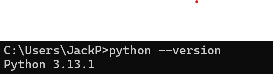

# IS310 Coding Assignments
# Init IS310 Homework

**Hypothes.is Username:** Honglip2

## Proof of Installation

1. Python

2. Git

3. VS Code

4. AI Tool/Workflow 

How will you work with AI? What tools if any do you plan to use?

I plan to use AI primarily to assist in coding and learning. For example, I can ask AI to help me understand programming concepts, generate example code, or debug issues. I also plan to use ChatGPT specifically to check spelling and grammar in my written work, ensuring that my explanations and documentation are clear and accurate. Maybe I will use github copilot only if i needed them to learn and not for doing my whole assignment.

# Examples of Digital Objects

## Player Avatar
**Why it counts as a digital object:**  
A player avatar is a digital representation of the player in the game world.  
It represents the player’s identity, actions, and presence within the virtual environment.

## Game Maps
**Why it counts as a digital object:**  
Game maps are digital representations of physical or imaginary spaces.  
They translate geography, architecture, and spatial design into navigable digital environments that players can explore and interact with.

---

