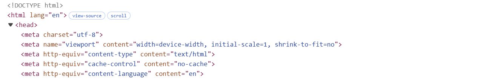
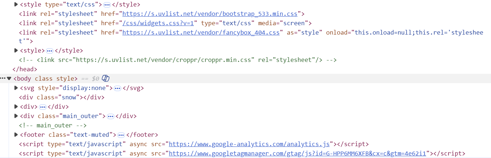

# Assignment 1: Inspecting the Cultural Web
## Digital Archive:
- [Universal Videogame List](https://www.uvlist.net/): UVL is the biggest on-line database about any video game ever created. Find more about the video games, their characters, the publishes and developers involved and all the platforms ever made since the 70's.

## What Web Technologies Used:
 **HTML** Used to structure the content of the page, defining the layout, headings, and elements that organize the information.
    

 **CSS** used for styling the page, including layout formatting, colors, fonts, and responsiveness.
 **JavaScript** used to provide interactivity and dynamic content on the site. 
    

File :
The page mainly consists of image files like .svg, .jpg, and .png, which serve for illustrations and other visual elements. Upon examining the page, no unfamiliar file types were observed. In general, images make up the majority of the page’s content.

## Who buit this website:
The website Moby Games was founded and made by **Andrea Doimo**. 

Can't find a github link to the creator’s personal website.
